# Text-Classification-with-Albert

ALBERT is a transformer-based language representation model developed by Google. ALBERT aims to provide a more efficient and compact architecture compared to BERT while maintaining competitive performance on various NLP tasks.

In this project, I am using amazon review dataset to perform sentiment analysis using a pre-trained ALBERT model sourced from the Hugging Face library. 

Data Source: url = "https://s3.amazonaws.com/fast-ai-nlp/amazon_review_full_csv.tgz"

### Installing dependencies
First, I have installed necessary dependencies using 'pip'. The 'transformers' library and 'sentencepiece' are installed. 
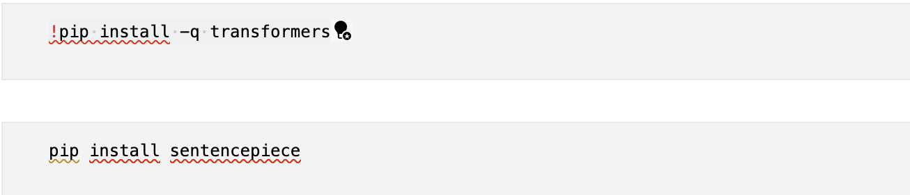
SentencePiece is an unsupervised text tokenizer and detokenizer which allows the vocabulary size to be predetermined before training the neural model.

### Setting up the environment
The next block of code sets up the device for GPU usage. 

### Loading the dataset
The Amazon review dataset is downloaded and extracted. 
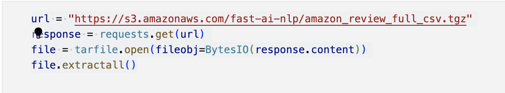
The training and test datasets are loaded into Pandas DataFrames (train and test). I have only included relevant columns 'Rating', 'Title', 'ReviewText' from the dataset.
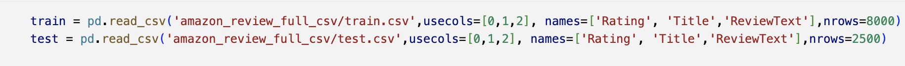

### Data Preprocessing

#### Categorize rating to different sentiment groups
I have defined a 'classify_rating()' function to categorize ratings into different sentiment groups based on their numerical values.
If the rating is greater than 3, it is classified as 'Positive'. If the rating is less than 3, it is classified as 'Negative' else it is classified as 'Neutral'. Then, I have added new column 'Sentiment' based on the rating.
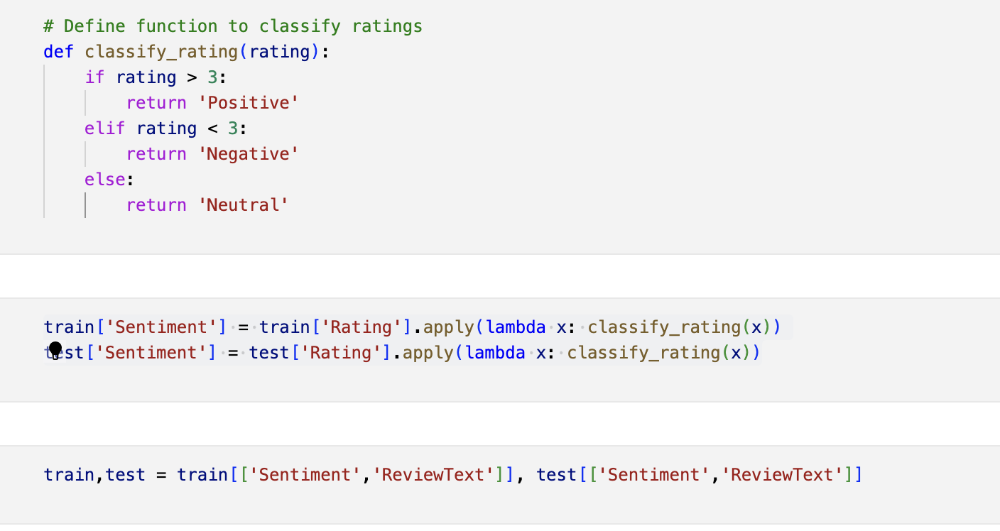

#### Convert labels to numeric values
The label2id dictionary is created to map sentiment labels to numerical IDs. And for further processing, I am assigning the numerical IDs back to the "Sentiment" column. 
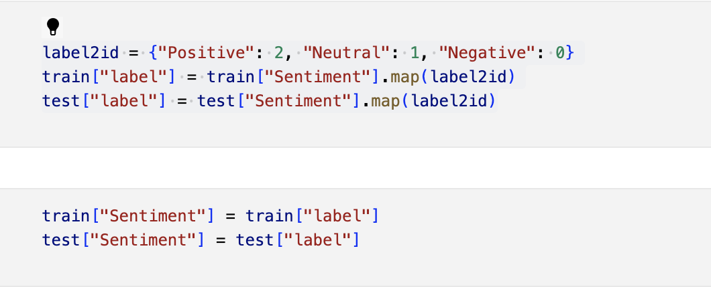

For model training, I am discarding other columns and just selecting 'Sentiment' and 'ReviewText' columns.
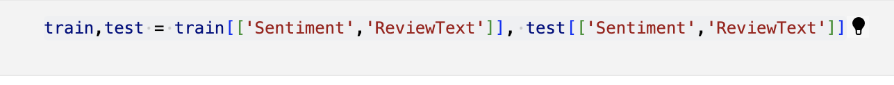
After preprocessing, the train and test dataframe looks as below.
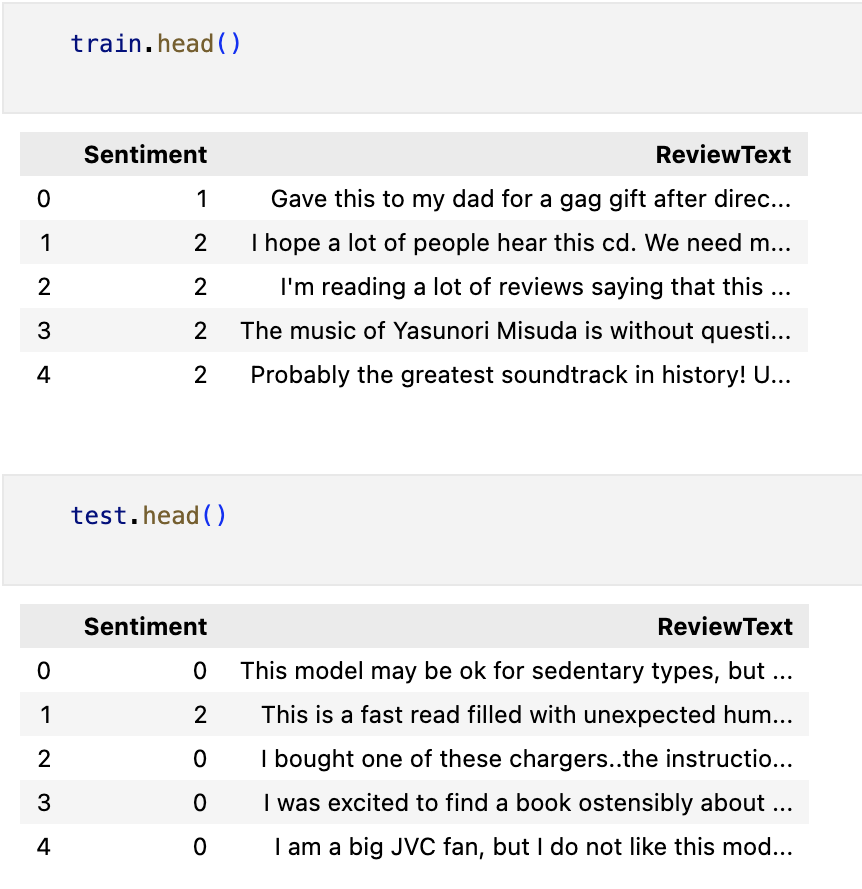

### Tokenization
The following code snippet instantiates an  AlbertTokenizerFast from the Hugging Face transformers library. This tokenizer is initialized with the pre-trained weights of the 'albert-base-v2' model. Then we have defined he 'AmazonReviewDataset' class to prepare the input data for the model.
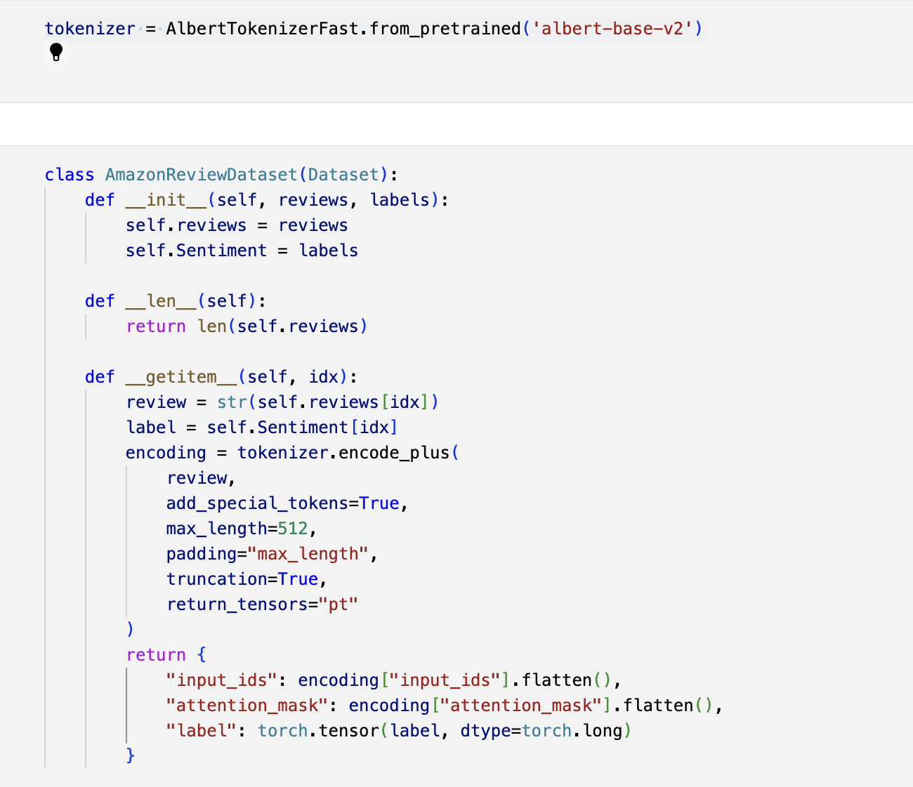

Each dataset contains review texts tokenized and encoded into input IDs and attention masks, along with their corresponding sentiment labels as PyTorch tensors.
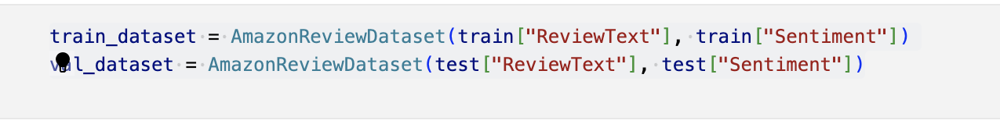

I have used a batch size of 16 to reduce memory usage and improve computational efficiency during training and validation. The train_loader is created for the training dataset (train_dataset) which batches the data with a batch size of 16 and shuffles the data during each epoch, which helps in preventing the model from learning the order of the samples and improves generalization. The 'val_loader' is created for validation dataset for evaluating the model's performance.
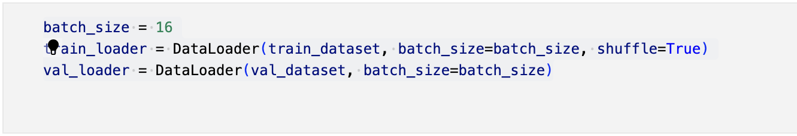

### Model initialization
I have initialized the ALBERT model for sequence classification(AlbertForSequenceClassification) from the pre-trained albert-base-v2 checkpoint. The model is moved to the appropriate device (GPU or CPU).
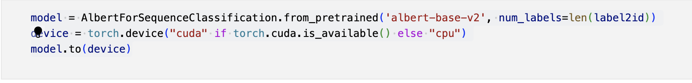

### Define the optimizer and learning rate
In the following code block, I have set up an Adam optimizer with a learning rate of 2e-5 and a learning rate scheduler that decreases the learning rate by 10% after each epoch.
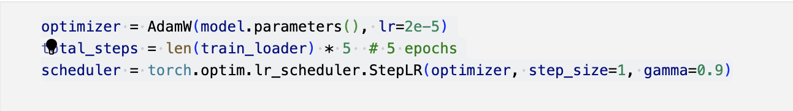

### Model training, Validation and Evaluation
I have set up the number of epochs to 5 in order to train the neural network.  
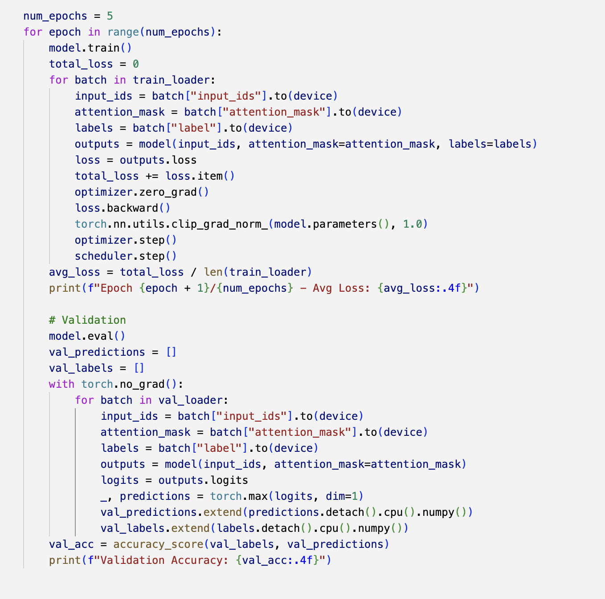
After each epoch, the model's performance is evaluated on the validation set.

It appears that the training loss is fluctuating slightly over epochs, while the validation accuracy remains constant at 63.08%. This could suggest that the model may not be learning effectively or that the dataset or model architecture may need further optimization or investigation

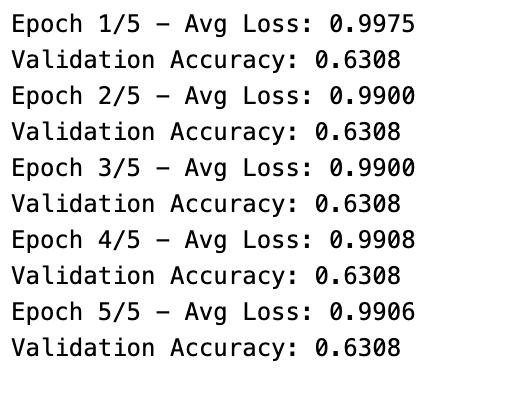

When evaluated on the training set, the overall accuracy of the model on the training set is 62.66%. This indicates that the model correctly predicts the sentiment for approximately 62.66% of the reviews in the training dataset. 
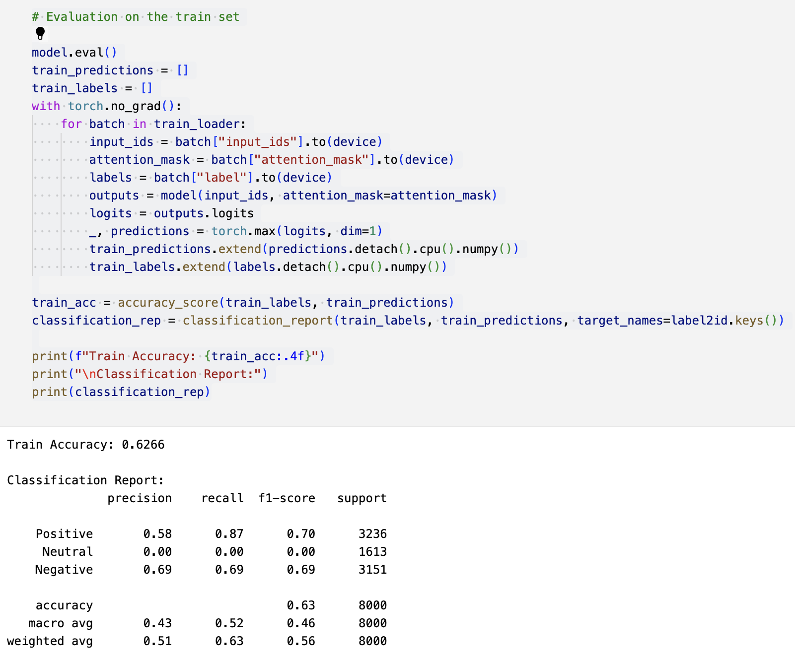

## Conclusion
This project leverages the power of ALBERT, a cutting-edge transformer-based language model, to tackle the task of sentiment analysis on Amazon reviews. Despite observing fluctuations in training loss, the model's validation accuracy remains stagnant at 63.08%, prompting further investigation into potential optimization method. Fine-tuning model hyperparameters, such as learning rate or batch size, could potentially enhance model learning and generalization.