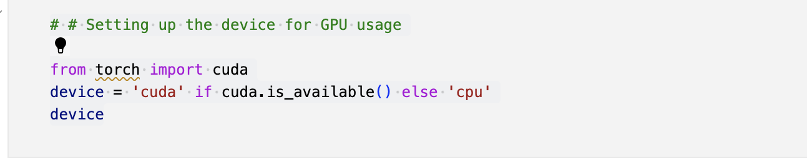

# Text-Classification-with-Albert

ALBERT is a transformer-based language representation model developed by Google. ALBERT aims to provide a more efficient and compact architecture compared to BERT while maintaining competitive performance on various NLP tasks

Data Source:

### Installing dependencies
First, I have installed necessary dependencies using 'pip'. The 'transformers' library and 'sentencepiece' are installed. 

### Setting up the environment
The next block of code sets up the device for GPU usage. 

### Loading the dataset
The Amazon review dataset is downloaded and extracted. The training and test datasets are loaded into Pandas DataFrames (train and test).

### Data Preprocessing
I have only included relevant columns 'Rating', 'Title', 'ReviewText' from the dataset and have added new column 'Sentiment' based on the rating. The label2id dictionary is created to map sentiment labels to numerical IDs.

### Tokenization
The AlbertTokenizerFast from the transformers library is used to tokenize the reviews. The AmazonReviewDataset class is defined to prepare the input data for the model.

### Model initialization
The ALBERT model for sequence classification (AlbertForSequenceClassification) is loaded from the pre-trained albert-base-v2 checkpoint. The model is moved to the appropriate device (GPU or CPU).

### Model training
The model is trained for a specified number of epochs (num_epochs). In each epoch, the training data is iterated over in batches, and backpropagation is performed to update the model's weights. An AdamW optimizer is used with a learning rate of 2e-5, and a learning rate scheduler is employed.

### Validation and Evaluation
After each epoch, the model's performance is evaluated on the validation set. Validation accuracy is calculated, and the results are printed. After training, the model's performance is evaluated on the training set. Training accuracy and the classification report (including precision, recall, and F1-score) are printed.

